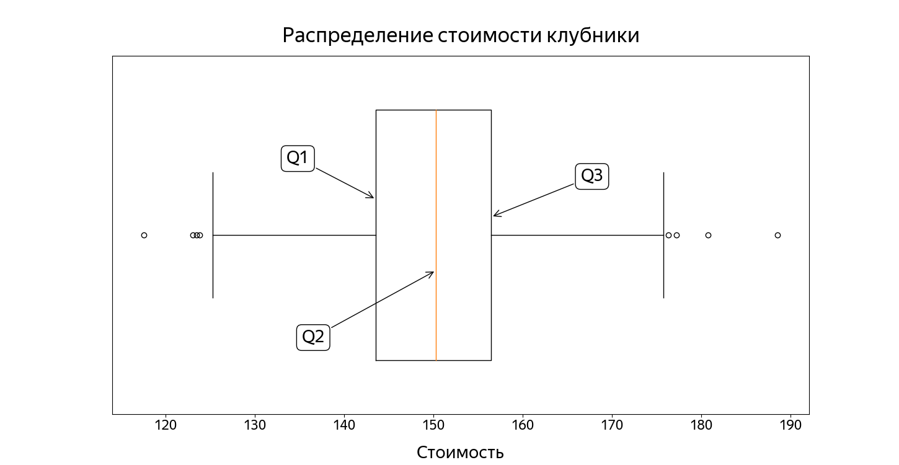

# Оглавление

- [Оглавление](#оглавление)
  - [Описание репозитория](#описание-репозитория)
  - [Основные понятия используемые в репозитории](#основные-понятия-используемые-в-репозитории)
    - [Генеральная совокупность и выборка](#генеральная-совокупность-и-выборка)
    - [Типы данных](#типы-данных)
  - [Среднее значение](#среднее-значение)
    - [Развернутая запись суммы](#развернутая-запись-суммы)
    - [Пример](#пример)
  - [Медиана](#медиана)
  - [Распределение](#распределение)
  - [Квантиль](#квантиль)
  - [Выбросы](#выбросы)
  - [Ящик с усами](#ящик-с-усами)

---

## Описание репозитория

Этот репозиторий посвящен изучению статистики через Python и его библиотеки, а также отработке приемов визуализации результатов расчетов.

Часть материала взята из бесплатного курса "Основы статистики и A/B-тестирования" от Яндекс Практикум.  
[Ссылка на курс](https://start.practicum.yandex/statistics-basic/)  

---

## Основные понятия используемые в репозитории

### Генеральная совокупность и выборка

**Генеральная совокупность** — это полный набор объектов, явлений или данных, которые изучаются в рамках исследования. Она включает в себя все возможные элементы, относящиеся к определенному вопросу или задаче. Например, если мы хотим изучить средний рост всех студентов одного университета, то генеральной совокупностью будет множество всех студентов этого университета.

Примеры генеральных совокупностей:  
* Все жители страны.  
* Все автомобили определённой марки, выпущенные за год.  
* Все транзакции, совершённые в банке за месяц.  
* Все деревья в лесу.   

**Выборка** — это подмножество генеральной совокупности, которое используется для анализа и выводов о всей совокупности. Исследование всей генеральной совокупности часто невозможно или нецелесообразно из-за её огромного размера или высоких затрат. Поэтому исследователи берут выборку, которая должна быть репрезентативной , то есть точно отражать характеристики генеральной совокупности.  

Примеры выборок:  
* Если генеральная совокупность — все студенты университета, то выборкой может быть 100 случайно выбранных студентов.  
* Если генеральная совокупность — все жители города, то выборкой могут быть 500 человек, опрошенных по телефону.  
* Если генеральная совокупность — все транзакции банка, то выборкой могут быть транзакции за одну неделю.  

**Репрезентативная выборка** — это подмножество генеральной совокупности, которое точно отражает её основные характеристики. Другими словами, выборка считается репрезентативной, если её структура (например, распределение по возрасту, полу, доходу или другим параметрам) соответствует структуре всей генеральной совокупности. Это позволяет делать достоверные выводы о всей совокупности на основе анализа выборки.  

Для того чтобы выборка была репрезентативной, она должна учитывать ключевые характеристики генеральной совокупности. Например:  

* **Возраст**: В городе живут люди разных возрастных групп. Если большинство населения** — молодёжь, то выборка не должна состоять в основном из пожилых людей.  
* **Пол**: Если в городе мужчин и женщин примерно поровну, то их должно быть поровну и в выборке.  
* **Доход**: Уровень дохода влияет на предпочтения в питании. Выборка должна включать людей с разным уровнем дохода в тех же пропорциях, что и в городе.  
* **География**: Если город разделён на районы с разным уровнем жизни, выборка должна охватывать все районы.  

### Типы данных

| **Тип данных**      | **Пример**                  | **Значения**                              | **Особенности**                                                                 |
|----------------------|-----------------------------|-------------------------------------------|---------------------------------------------------------------------------------|
| **Категориальные**   | Марка автомобиля            | Toyota, BMW, Ford, Tesla                  | Нет порядка или ранжирования между категориями.                                 |
| **Порядковые**       | Класс автомобиля            | Эконом, Стандарт, Премиум                 | Есть порядок, но разница между категориями не измеряется количественно.         |
| **Числовые (дискр.)**| Количество дверей          | 2, 4, 5                                   | Целочисленные значения, связанные с подсчетом.                                  |
| **Числовые (непр.)** | Объем двигателя (в литрах) | 1.6, 2.0, 3.5                             | Непрерывные значения, которые можно измерять с любой точностью.                 |  

## Среднее значение
Среднее значение вычисляется по формуле:

$$
\bar{x} = \frac{1}{n} \sum_{i=1}^{n} x_i
$$

где:
- \(n\) — количество элементов в наборе данных,
- \(x_i\) — значение каждого элемента.


### Развернутая запись суммы
Сигму всегда можно «развернуть» в длинную сумму:

$$
\sum_{i=1}^{n} x_i = x_1 + x_2 + x_3 + \dots + x_n
$$

где:
- \(i\) — индекс суммирования,
- \(x_i\) — значение каждого элемента,
- \(n\) — количество элементов.

### Пример
Для наглядности рассмотрим пример. Пусть дан набор данных:

$$
x = \{2, 4, 6, 8\}
$$

1. Количество элементов: \(n = 4\).
2. Сумма элементов:

$$
\sum_{i=1}^{4} x_i = 2 + 4 + 6 + 8 = 20
$$

3. Среднее значение:

$$
\bar{x} = \frac{1}{4} \cdot 20 = 5
$$

Таким образом, среднее значение данного набора данных равно **5**.  

## Медиана  
**Медиана** — это наблюдение, которое делит весь набор данных на две равные части: меньше него 50% наблюдений и больше него тоже 50% наблюдений.  
В случае, если число элементов четное, нужно взять два значения, которые стоят ближе всего к середине, сложить и разделить пополам. 

**Алгоритм вычисления медианы**:  
1) Упорядочить элементы в списке по возрастанию.
2) Посчитать количество элементов в списке.
3) а. Если число элементов в списке нечётное, найти число, стоящее посередине.  
3) б. Если число элементов чётное, найти два числа, которые находятся посередине, сложить их и результат разделить пополам.

## Распределение  
**Распределение** в статистике описывает, как значения случайной величины (например, рост людей, доходы, результаты тестов и т.д.) распределяются по диапазону возможных значений.  

**Симметричное распределение** — это тип распределения, при котором данные равномерно распределены вокруг центральной точки (среднего, медианы или моды). В этом случае левая и правая части распределения являются зеркальным отражением друг друга.  

**Асимметричное распределение** — это тип распределения, при котором данные несимметрично распределены вокруг центральной точки. Одна сторона распределения ("хвост") длиннее другой.  

| Параметр                    | Симметричное распределение          | Асимметричное распределение         |
|-----------------------------|-------------------------------------|-------------------------------------|
| **Форма**                   | Зеркальная симметрия               | Несимметричная форма                |
| **Центральная тенденция**   | Среднее = Медиана = Мода           | Среднее ≠ Медиана ≠ Мода            |
| **Коэффициент асимметрии**  | Skewness = 0                       | Skewness ≠ 0 (положительный/отрицательный) |
| **Примеры**                 | Рост людей, результаты тестов       | Доходы, цены на жилье, время реакции |
| **Типы асимметрии**         | Не применимо                       | Правосторонняя (положительная), левосторонняя (отрицательная) |
| **Практическое значение**   | Используется в классической статистике | Часто встречается в реальных данных (экономика, социальные науки) |  

## Квантиль

**Медиана** — это частный случай квантиля. Медиана помогает отсечь ровно половину данных, а квантиль — любую заданную часть.  

Рассмотрим простой набор данных: 
10, 20, 30, 40, 50, 60, 70, 80, 90, 100.

Найдём 0.2-квантиль. Это означает, что нам надо найти такое число в заданном наборе, что 20% от общего количества значений будут меньше или равны ему.  

Для этого обычно выполняют следующие шаги:  
1) ортируют набор данных по возрастанию.  
2) Находят номер элемента по такой формуле:   
```n ⋅ α```, где:  
**n** — количество элементов в наборе, 
**α** — доля, которая нас интересует.

В нашем примере 10 значений. Они уже отсортированы. Порядковый номер искомого значения равен ```10 ⋅ 0.2``` = 2. Соответственно, значение 20 и будет 0.2
0.2-квантилем. Заметим, что справа от него будет 100% − 20% = 80% значений.  

## Выбросы

**Выброс** — это значение или набор значений в наборе данных, который сильно отличается от остальных.

В контексте статистического анализа выбросы могут указывать на неправильно записанные данные, ошибки в измерениях или редкие и необычные случаи. Иногда выбросы могут значительно искажать общую картину данных и влиять на результаты статистического анализа.  

Универсального алгоритма здесь нет. В зависимости от задачи аналитик сам принимает решение, по каким правилам определять выбросы. Иногда пороги подбирают другими методами, иногда даже вручную.  
Один из методов — использовать квартили и IQR. 

Zдро данных лежит между Q1 и Q3. Будем считать допустимым отклонение от этих границ на 1.5 ⋅ IQR Всё, что лежит за пределами полученного интервала, будем считать выбросами.  

**Сформулируем алгоритм, как найти выбросы:**

1. Отсортировать данные в возрастающем порядке.
2. Вычислить первый квартиль Q1 (0.25-квантиль) и третий квартиль Q3 (0.75-квантиль).
3. Рассчитать межквартильный размах:  
   IQR = Q3 - Q1.
4. Определить границы выбросов:
   - нижняя граница:  
     Q1 - 1.5 * IQR,
   - верхняя граница:  
     Q3 + 1.5 * IQR.
5. Отсеять все значения, которые лежат за пределами этих границ — они считаются выбросами.

**Определим выбросы для зефирного набора.**

Отсортированные данные:  
26, 27, 29, 30, 32, 33, 34, 35, 36, 36, 37, 37, 38, 38, 39, 41, 42, 44, 45, 47.

1. **Определим Q1.**  
   Порядковый номер элемента:  
   20 * 0.25 = 5.  
   Значит, Q1 = 32.

2. **Определим Q3.**  
   Порядковый номер элемента:  
   20 * 0.75 = 15.  
   Значит, Q3 = 39.

3. **Рассчитаем межквартильный размах (IQR):**  
   IQR = Q3 - Q1 = 39 - 32 = 7.

4. **Определим границы выбросов:**  
   - нижняя граница:  
     Q1 - 1.5 * IQR = 32 - 1.5 * 7 = 21.5,  
   - верхняя граница:  
     Q3 + 1.5 * IQR = 39 + 1.5 * 7 = 49.5.

5. **Проверим наличие выбросов:**  
   Все наблюдения, меньшие 21.5 или большие 49.5, считаются выбросами.  
   В выборке таких значений нет.  

**Итог:** В данных отсутствуют сильно выбивающиеся значения.

## Ящик с усами

  


* **Левая граница ящика** — первый квартиль (Q1), то есть 25% данных находятся ниже этого значения.  
  В нашем примере: `Q1 = 143.5`.

* **Медиана** (второй квартиль, Q2) показана вертикальной линией внутри ящика. Медиана делит данные на две равные части: половина значений меньше неё, другая половина — больше.  
  В нашем примере: `Q2 = 150.3`.

* **Правая граница ящика** — третий квартиль (Q3), то есть 75% данных лежат ниже этой точки.  
  В нашем примере: `Q3 = 156.5`.

* **Ширина ящика** — это межквартильный размах (IQR). В данном случае: `IQR = 13`.  
  Высота ящика не несёт смысловой нагрузки и служит лишь для визуального оформления.

* **Усы ящика** расположены слева и справа от коробки, их длина равна `1.5 × IQR`. Это значение помогает определить диапазон значений, которые не слишком далеко отклоняются от центра распределения.

  - Левый ус ограничен значением:  
    `Q1 − 1.5 × IQR = 143.5 − 1.5 × 13 = 124`.

  - Правый ус ограничен значением:  
    `Q3 + 1.5 × IQR = 156.5 + 1.5 × 13 = 176`.
